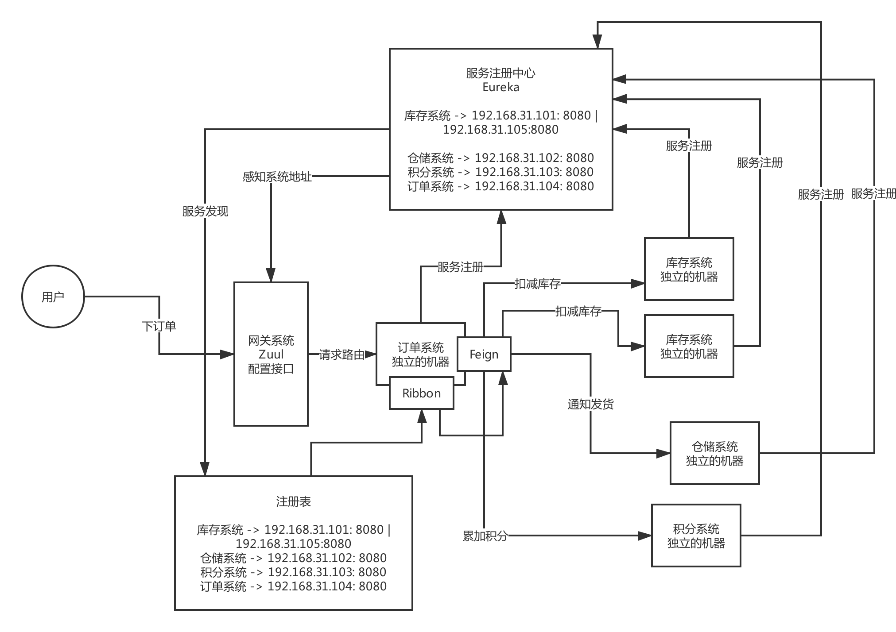

如果聊分布式这块的技术，围绕**Dubbo来拷问**的，但是呢，现在其实非常流行的是**Spring Cloud，Dubbo和Spring Cloud以及阿里系的一些技术**，现在正在融合，**Spring Cloud Alibaba，只不过现在用的公司暂时还没那么多而已**

作为合格的工程师，行业里主流的**分布式服务技术栈**，**Dubbo**和**Spring Cloud**两种，有的公司他是用**Dubbo**的，不用**Spring Cloud**的，有的公司是用**Spring Cloud**的，不用**Dubbo**的，他们是代表了两种主流技术栈

Java工程师，Dubbo和Spring Cloud起码是基本原理，都有一定的了解

**大白话 + 现场画图**

**分别用Dubbo和Spring Cloud做两个最基本的Demo工程**，用电商背景来搭建几个服务

比如说，现在我们有一个电商系统

用户现在需要下单购买一些东西这样子，订单系统、库存系统、仓储系统、积分系统

不太可能说用单块的架构，电商系统你想支撑多少用户量？10万注册用户，日活1000用户来你这里来购买？

百万级用户，十万级日活，单块系统就不太合适了，背后有几十个人的团队在协作开发，此时单块系统是绝对不合适的

梳理和明确一个概念：电商系统，拆分为了多个子系统，一次下订单的请求需要多个子系统协作完成，每个子系统都完成一部分的功能，多个子系统分别完成自己负责的事情，最终这个请求就处理完毕

Spring Cloud架构原理

### Spring Cloud

#### Eureka：服务注册中心
#### Feign：服务调用
#### Ribbon：负载均衡
#### Zuul/Spring Cloud Gatway:网关

这么多的系统，电商系统包含了20个子系统，每个子系统有20个核心接口，一共电商系统有400个接口，这么多的接口，直接对外暴露，前后端分离的架构，难道你让前端的同学必须记住你的20个系统的部署的机器，他们去做负载均衡，记住400个接口

微服务那块，**网关**

**灰度发布**、**统一熔断**、**统一降级**、**统一缓存**、**统一限流**、**统一授权认证**

**Hystrix**、**链路追踪**、**stream**、很多组件，Hystrix这块东西，其实是会放在高可用的环节去说的，并不是说一个普通系统刚开始就必须得用的，没有用好的话，反而会出问题，**Hystrix线路熔断的框架**，必须得设计对应的一整套的限流方案、熔断方案、资源隔离、降级机制，配合降级机制来做
